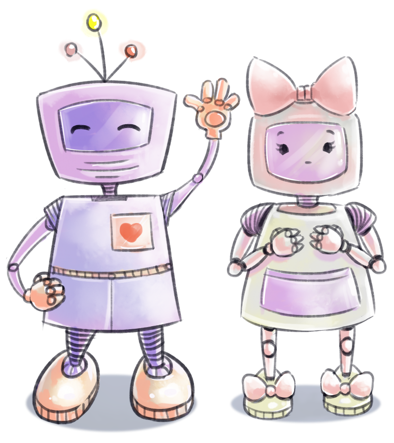

# Jambo

This bot is made to autonomously manage a discord server with regular game jams/hackathons and make it a pleasant and happy environment.  
It will collect the proposals for the jam, create polls for everyone to participate (with reactions directly on the server) and will give the server some more glamour with color roles for example.
You can read about the full set of features in our lovely wiki [here](https://github.com/Cowoding-Jams/Jambo/wiki).

## The team :)

Made with love by: [Antti](https://github.com/Chicken), [Lucy](https://github.com/BlackDemonFire), [Leonie](https://github.com/KommentatorForAll), [Murphy](https://github.com/StrangeGirlMurph), [Floschy](https://github.com/flloschy), [Amber](https://github.com/uselessamber), [Wilson](https://github.com/WilsontheWolf) ❤️  
We're all part of a game jam/hackathon server with monthly events and wanted to make our and your lives easier. Have fun coding!

## Usage & Development

We won't host the bot for you. If you want to use it on your own server you have to do that yourself :)  
To see how to use this bot on your own visit our [wiki](https://github.com/Cowoding-Jams/Jambo/wiki). It's really good! We promise. It can help you a lot.

## License

This project is licensed under the [Humane Software License](https://github.com/StrangeGirlMurph/The-Humane-Software-License). See [LICENSE](LICENSE).
